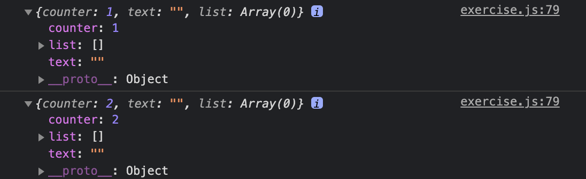

# 리덕스 활용해보기

- 간단하게 CLI를 통해 프로젝트를 생성한 뒤에 한 파일로 작성합니다.

```shell
// 프로젝트 생성하기
npx create-react-app study-redux

// redux 설치하기
npm i redux
```

- exercise.js

```js
// createStore : 스토어를 만들어주는 함수
import { createStore } from 'redux';

// 리덕스에서 글로벌로 관리할 상태 정의
const initialState = {
    counter: 0,
    text: '',
    list: []
}

// 액션 타입 정의
const INCREASE = 'INCREASE';
const DECREASE = 'DECREASE';
const CHANGE_TEXT = 'CHANGE_TEXT';
const ADD_TO_LIST = 'ADD_TO_LIST';

// 액션 생성함수 정의, type 필수
const increase = () => 
    ({
        type: INCREASE
    })
;

const decrease = () => 
    ({
        type: DECREASE
    });
;

const changeText = text => 
    ({
        type: CHANGE_TEXT,
        text
    })
;

const addToList = item => 
    ({
        type: ADD_TO_LIST,
        item
    })
;

// 리듀서 만들기 ( 불변성 지키기 )
function reducer(state = initialState, action){
    switch (action.type){
        case INCREASE:
            return {
                ...state,
                counter: state.counter + 1
            };
        case DECREASE:
            return {
                ...state,
                counter: state.counter - 1
            };
        case CHANGE_TEXT:
            return {
                ...state,
                text: action.state
            };
        case ADD_TO_LIST:
            return {
                ...state,
                list: state.list.concat(action.item)
            }
        default:
            return state;
    }
}

// 스토어 만들기
const store = createStore(reducer);

// subscribe을 활용하기 위한 listener 함수 만들기
const listener = () => {
    // store.getState() : store 안에 들어있는 상태를 조회
    const state = store.getState();
    console.log(state)
}

// 구독하기 : 상태가 변경될 때마다 등록한 listener 함수가 호출됩니다.
// 해제하기 : unsubscribe() 호출
const unsubscribe = store.subscribe(listener);

// 액션을 디스패치 해보기
store.dispatch(increase());a
store.dispatch(increase());
```

- 결과확인
  - `store.subscribe()`을 통해 상태가 변경될 때마다 함수를 호출하여 `store.getState()`을 통해 상태를 확인하였습니다.

