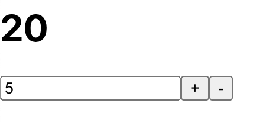

# 카운터 컴포넌트 구현 및 리덕스 적용

- components/counter/Counter.js

```react
import React from 'react';

function Counter({number, diff, onIncrease, onDecrease, onSetDiff}) {
    const onChange = e => {
        onSetDiff(parseInt(e.target.value));
    };
    return (
        <div>
            <h1>{number}</h1>
            <div>
                <input type='number' value={diff} mim="1" onChange={onChange} />
                <button onClick={onIncrease}>+</button>
                <button onClick={onDecrease}>-</button>
            </div>
        </div>
    )
}

export default Counter;
```

- components/counter/CounterContainer.js
  - `useSelector()` : 리덕스 스토어의 상태를 조회하는 Hook 입니다.
  - `useDispatch()` : 리덕스 스토어의 dispatch를 함수형 컴포넌트에서 사용할 수 있게 해주는 Hook 입니다.

```react
import React from 'react';
import { useSelector, useDispatch } from 'react-redux';
import Counter from './Counter';
import { increase, decrease, setDiff } from '../../modules/counter';

function CounterContainer(){
    // useSelector : 리덕스 스토어의 상태를 조회하는 Hook 입니다.
    // 콜백 함수로 state를 받아서 원하는 상태로 변수에 저장할 수 있습니다.
    const { number, diff } = useSelector(state => ({
        number: state.counter.number,
        diff: state.counter.diff
    }));

    // useDispatch : 리덕스 스토어의 dispatch를 함수형 컴포넌트에서 사용할 수 있게 해주는 Hook 입니다.
    const dispatch = useDispatch();

    // 액션 생성자 함수를 바탕으로 디스패치와 함께 이벤트를 생성 합니다.
    const onIncrease = () => dispatch(increase());
    const onDecrease = () => dispatch(decrease());
    const onSetDiff = diff => dispatch(setDiff(diff));

    return (
        <Counter
            number={number}
            diff={diff}
            onIncrease={onIncrease}
            onDecrease={onDecrease}
            onSetDiff={onSetDiff}
        />
    )
}

export default CounterContainer;
```

- 결과물



