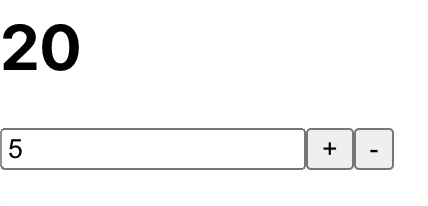

# 할 일 목록에 리덕스 적용해보기

- todo/Todos.js

```react
import React, { useState } from 'react';

const TodoItem = React.memo(function TodoItem({todo, onToggle}){
    return (
        <li
            style={{ textDecoration: todo.done ? 'line-through' : 'none'}}
            onClick={()=>onToggle(todo.id)}
        >
            {todo.text}
        </li>
    )
});

const TodoList = React.memo(function TodoList({ todos, onToggle }){
    return (
        <ul>
            {todos.map(todo => (
                <TodoItem key={todo.id} todo={todo} onToggle={onToggle} />
            ))}
        </ul>
    )
})

function Todos({ todos, onCreate, onToggle }) {
    // 글로벌로 관리할 필요가 없는 상태는 내부에서 관리해도 됩니다.
    const [text, setText] = useState('');
    const onChange = e => setText(e.target.value);
    const onSubmit = e => {
        e.preventDefault();
        onCreate(text);
        setText('');
    };

    return (
        <div>
            <form onSubmit={onSubmit}>
                <input 
                    value={text}
                    placeholder="여기에 입력하세요."
                    onChange={onChange}
                />
                <button type='submit'>등록</button>
            </form>
            <TodoList todos={todos} onToggle={onToggle} />
        </div>
    )
}

export default Todos;
```

- todo/TodosContainer.js

```react
import React, { useCallback } from 'react';
import { useSelector, useDispatch } from 'react-redux';
import Todos from './Todos';
import { addTodo, toggleTodo } from '../../modules/todos';

function TodosContainer() {
    const todos = useSelector(state => state.todos);
    const dispatch = useDispatch();

    const onCreate = useCallback(text => dispatch(addTodo(text), [dispatch]));
    const onToggle = useCallback(id => dispatch(toggleTodo(id), [dispatch]));

    return <Todos todos={todos} onCreate={onCreate} onToggle={onToggle} />
}

export default TodosContainer;
```

- 결과



