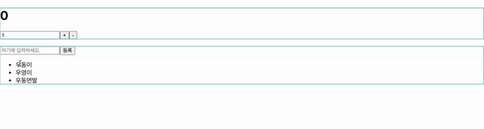

# useSelector 최적화해보기

- 기본적으로 `useSelector`를 사용하여 리덕스 스토어의 상태를 조회할 때 만약 상태가 변경되지 않았으면 리렌더링을 진행하지 않습니다.
- 하지만 기존에 작성한 CounterContainer 컴포넌트에서는 매번 `useSelector`를 활용해 새로운 객체를 반환합니다.
  - 그래서 상태가 변경되지 않았음에도 불구하고 계속 리렌더링 됩니다.

```js
const { number, diff } = useSelector(state => ({
    number: state.counter.number,
    diff: state.counter.diff
}));
```

- 상관 없는 컴포넌트에서 상태를 변경시 Counter 컴포넌트에서 불필요한 **리렌더링**이 발생합니다.



## 해결 방법

- 새로운 객체를 반환히지 않고 개별적으로 상태를 받으면 해결 됩니다.

```js
const number = useSelector(state => state.counter.number);
const diff = useSelector(state => state.counter.diff);
```

- `react-redux`가 기본적으로 제공하는 `shallowEqual`함수를 활용하면 손쉽게 해결할 수 있습니다.
  - `useSelector`의 두번째 파라미터로 넣어주면 됩니다.
  - 이전 값과 다음 값을 비교해서 `true`가 나오면 리렌더링을 하지 않고 `false`가 나오면 리렌더링을 진행합니다.
  - 얕은 비교만 진행 합니다.

```js
import { useSelector, useDispatch, shallowEqual } from 'react-redux';

const { number, diff } = useSelector(state => ({
    number: state.counter.number,
    diff: state.counter.diff
}), shallowEqual);
```

