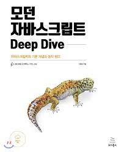

# 📚 모던 자바스크립트 Deep Dive ( 915page )

- 효율적으로 공부하기 위해 이미 학습하고 자바스크립트 레포에 정리했던 부분들은 다시 한번 읽고 빠르게 학습할 예정입니다.
- 또한 처음보고 꼭 기억해야할 부분들은 따로 목차별로 정리해서 **업로드**할 예정입니다.
- 하루에 할당량이 많더라도 할당량을 채우기에 목표를 두지 않고 그동안 모르고 지나첬던 부분들을 중점으로 공부할 계획입니다.
  - 만약 할당량을 채우지 못할 경우 계획표는 수정되며 다음 일로 이월 됩니다.
  - 과거 계획 내역은 보존합니다.

## ⭐ 계획표

|   날짜   |                    범위                    |     확인      |     정리      |
| :------: | :----------------------------------------: | :-----------: | :-----------: |
| 5-11(화) |        1장 (1page) ~10장 (135page)         | :green_heart: | :green_heart: |
| 5-12(수) |      11장 (137page) ~ 18장 (258page)       |               |               |
| 5-13(목) |      19장 (260page) ~ 26장 (489page)       |               |               |
| 5-14(금) |      27장 (492page) ~ 30장 (576page)       |               |               |
| 5-15(토) |   충족을 못할 경우 부족한 부분 공부하기    |               |               |
| 5-16(일) | 마무리 진도 나가기 및 정리한 것들 복습하기 |               |               |

## ⭐ 상세보기

- 5-11(화)
  - 1장 프로그래밍 (1~4)
  - 2장 자바스크립트란? (6~15)
  - 3장 자바스크립트 개발 환경과 실행 방법 (17~32)
  - 4장 변수 (34~47)
  - 5장 표현식과 문 (50~57)
  - 6장 데이터 타입 (60~72)
  - 7장 연산자 (75~92)
  - 8장 제어문 (93~106)
  - 9장 타입 변환과 단축 평가 (108~123)
  - 10장 객체 리터럴 (124~135)
- 5-12(수)
  - 11장 원시 값과 객체의 비교 (137~151)
  - 12장 함수 (154~186)
  - 13장 스코프 (189~198)
  - 14장 전역 변수의 문제점 (200~207)
  - 15장 let, const 키워드와 블록 레벨 스코프 (208~218)
  - 16장 프로퍼티 어트리뷰트 (219~232)
  - 17장 생성자 함수에 의한 객체 생성 (234~246)
  - 18장 함수와 일급 객체 (249~258)
- 5-13(목)
  - 19장 프로토타입 (260~311)
  - 20장 strict mode (313~319)
  - 21장 빌트인 객체 (320~339)
  - 22장 this (342~354)
  - 23장 실행 컨텍스트 (359~386)
  - 24장 클로저 (389~413)
  - 25장 클래스 (417~466)
  - 26장 ES6 함수의 추가 기능 (469~489)
- 5-14(금)
  - 27장 배열 (492~551)
  - 28장 Number (552~560)
  - 29장 Math (561~563)
  - 30장 Date (566~576)