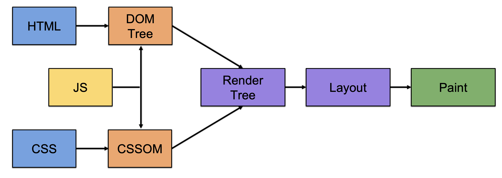
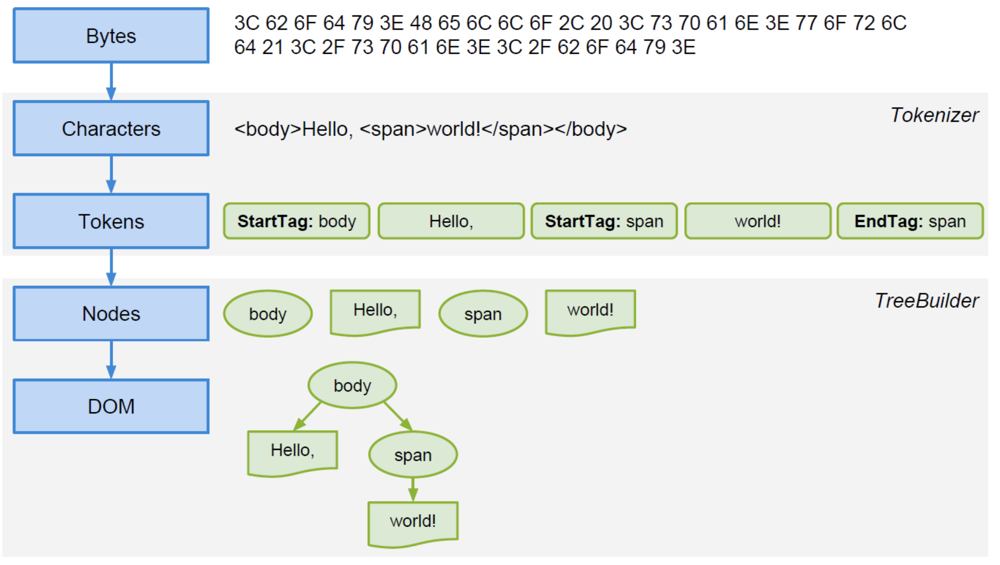
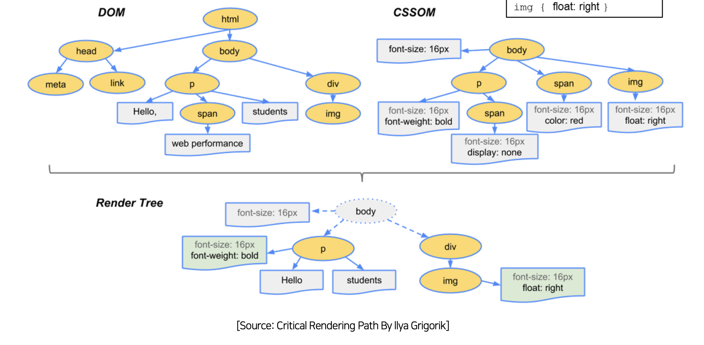
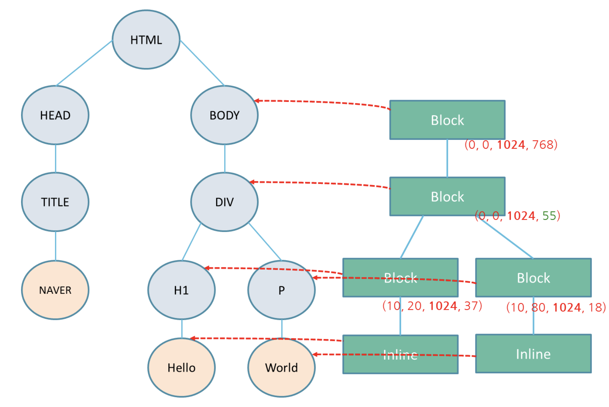
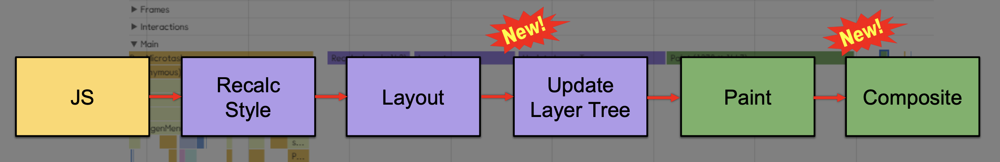

# 1강. Summary of how browsers work

## 1-1 HTML Parser

- HTML 문서를 Parsing 하여 DOM Tree를 만드는 과정
- DOM Tree를 만드는 이유 : 쉽게 가공하기 위해서 입니다.
- 전체가 없어도 일부의 데이터만 받아도 바로 **Parsing** 작업을 수행합니다.
- HTML 5가 도입되면서 에러처리를 명시해줌으로써 거의 모든 브라우저의 렌더링되는 모습이 비슷합니다.

## 1-2 Java Script Engine

- 자바스크립트를 실행해주는 **엔진**입니다.
- 자바스크립트 코드를 처리해서 Bytecode로 변환하다가 핫스팟을 찾으면 **JIT Compiler**가 작업을 수행합니다.
  - JIT Compiler : 프로그램 실제 실행하는 시점에 기계어로 번역하는 컴파일 기법

## 1-3 Recalculate Style

- Parsing 된 CSS 결과(CSSOM)를 **Render Tree**에 적용하는과정입니다.
  - DOM Tree에 각각 CSS 적용
  - CSS Parsing 과정은 개발자 도구에 보여지지 않습니다.
- DOM과 비슷하게 CSS도 CSSOM이 존재합니다.
- 외부 링크로 정의된 경우 렌더링은 블로킹 됩니다.

## 1-4 Render Tree

- Recalculate Style의 결과입니다.
- Render Tree = DOM Tree + CSSOM Tree
- **화면에 보이는 요소**들을 중심으로 구성합니다.
- `body`가 root입니다.
- 특이사항 : `span`태그가 존재하지 않습니다. ( 이유는 `display: none`)

## 1-5 Layout

- Render Tree 노드들의 좌표를 계산하는 과정 입니다.
- CSS 2.1 Box Model, Visual formatting model을 기반으로 합니다.
- 박스의 크기와 위치를 계산하는 과정 입니다.
  - 박스의 크기와 위치만 계산하면 좌표계산이 끝나게 됩니다.
  - 즉 브라우저의 렌더링 과정은 쉽게 진행할 수 있다.
- 윈도우 사이즈를 변경하거나 폰트 변경시 전체 레이아웃이 다시 발생하게 됩니다.
  - 이 외에 나머지는 incremental parsing이 진행합니다. ( 해당 바뀌는 부분만 Layout 진행 )
- Layout 알고리즘
  - Block은 아래로만 쌓이게 됩니다.
  - Inline은 옆으로 쌓이게 됩니다.

## 1-6 Paint

- 브라우저 화면에 그려주는 작업입니다.
- 프린터 처럼 하나씩 그리게 됩니다. ( 엄청 느리다! )

## 1-7 최신 브라우저에서의 흐름

- 보통 JS를 시작점으로 보고 있습니다.
- Update Layer Tree : 렌더링에 사용될 최종 Layer들을 계산 해서 생성 하는 과정
  - 여러 층으로 분리해서 Paint를 진행해야 일부분만 변경하면 그 층만 다시 그리면 되기 때문!
- Composite : 브라우저가 만든 Layer들을 합성하는 과정
  - 한장의 bitmap으로 만들게 됩니다.
  - Paint는 각 Layer 별로 Paint를 진행합니다.
- Layer의 장점은 빠르지만 단점이 메모리를 많이 사용해서 죽는 경우가 생깁니다.