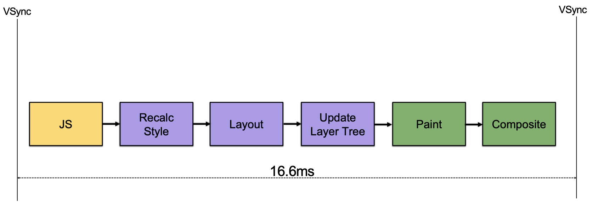
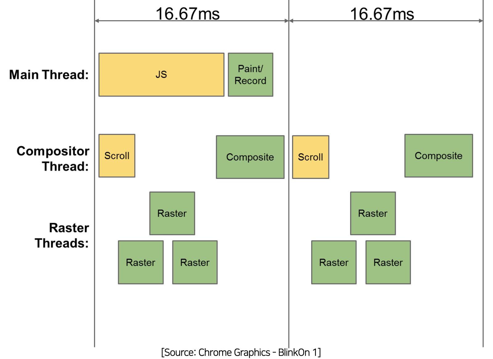

# 2. How the browser makes a frame?

## 2-1. Vsync Overview

- Vsync : 프레임을 모니터의 주사율과 동기화 시켜주는겁니다
  - 프레임이 모자랄 경우에는 모니터 주사율의 절반으로 떨어트려서 동기화 시켜버립니다.
- 60hz의 의미 : 모니터가 16.6ms 단위로 Frame Buffer의 내용을 가져갑니다!
- 브라우저도 Vsync를 기반으로 작동합니다.

- 이상적인 그림이지만 실제적으로 이렇게 동작하기에는 매우 어렵습니다.
  - 과거에는 보통 2~3프레임으로 위의 과정을 수행합니다.
  - 하나의 메인 쓰레드에서 모든 작업을 수행하기 때문입니다.

## 2-2 Main Thread Rendering

- Compositer Thread : Composite 과정을 따로 분리해서 처리합니다.
  - 장점 : Scroll 작동시 Compositer Thread만 동작하게 됩니다.
- Raster Thread : Bitmap으로 만드는 과정

- 크롬 및 최신 브라우저들은 3개의 Thread를 바탕으로 1프레임에 모든 작업을 수행하고 있다.