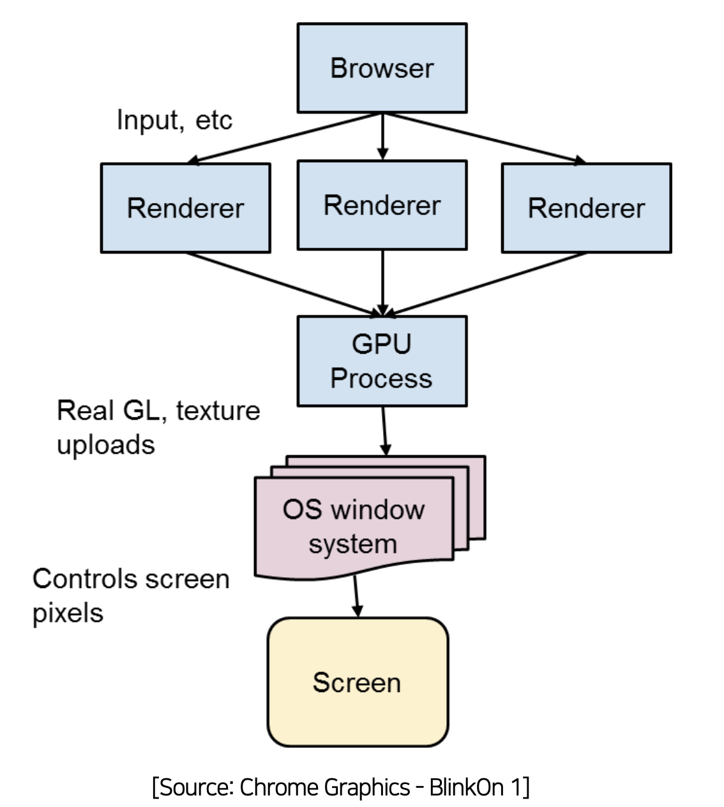
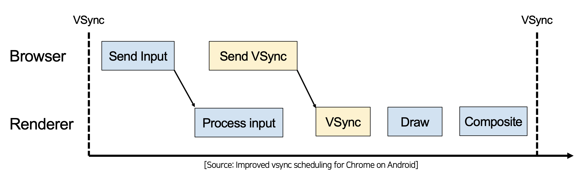
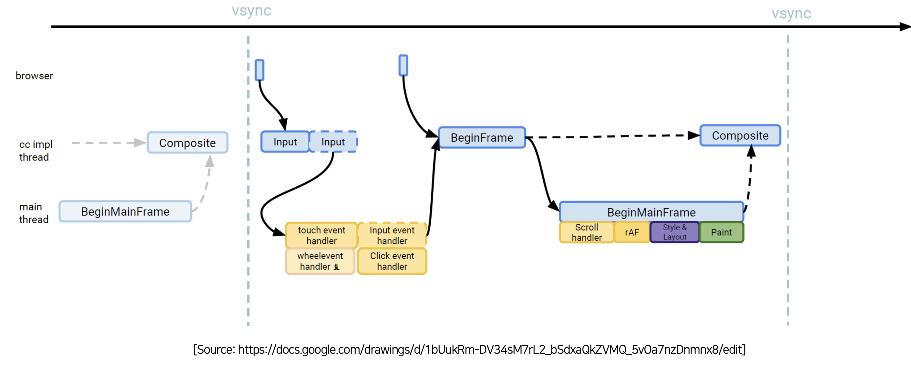

# 3.Vsync based browser processing

- 브라우저는 멀티프로세스를 기반으로 구조를 가지고 있습니다.

- Brower 프로세스 : UI를 담당합니다.
- Renderer 프로세스 : 1~2장에서 설명한 Reflow와 Refaint 과정입니다.
- GPU Process : 실제 화면에 렌더링을 담당합니다.

## 3-1 VSync aligned input handling

- input이 VSync 보다 먼저 들어온 경우 : 순차적으로 실행 됩니다.
- input이 VSync 이후에 들어온 경우 : 화면에 그려주고 있는데 dom이 변경됨으로 step이 꼬이게 됩니다.
- 이것을 해결하기 위해 VSync aligned input handling 개념이 도입되었습니다.
  -  input이 들어오면 input을 버퍼링했다가 VSync가 발생하면 input을 먼저 보내주 VSync을 보내줍니다.
  - 항상 input을 먼저 처리하는 파이프라인이 완성되었습니다.

## 3-2 VSync aligned frame handling

- cc : Compositer Thread
- input이 가장 먼저 들어온 후 처리하고 vsync가 들어오면서 렌더링을 요청하게 됩니다!
- 그럼 input이 앞쪽에 놓은 이유 : input이 먼저 들어와야  바로 좌표계산하고 그릴 수 있기 때문에

## 3-3 VSync based brower processing

- VSync을 다 처리하고 시간이 남을 때 Idle callback이 알려줍니다. 
  - 나 한가해!
  - 브라우저가 한가할 때 안 중요한 일들을 Idle callback에 연결해서 처리합니다.