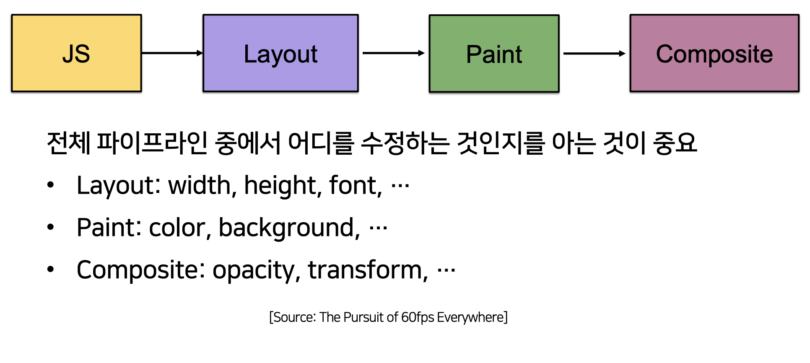
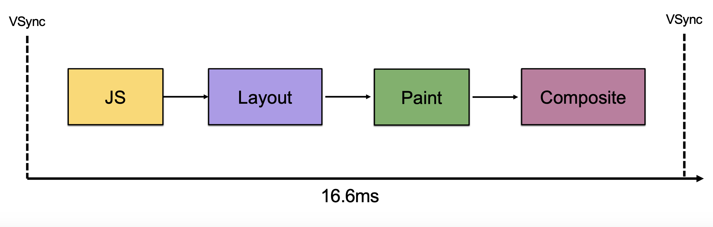

# 4.Rendering pipeline stage costs

- 실제로 서비스에 어떻게 적용할 수 있을까?

## 4-1 Pipeline stage costs

- 이 파이프라인이 제일 중요합니다.
- 작업을 했을 때 **Composite**단계에서 이루어지면 속도가 제일 빠르고 JS에서 작업을 하면 속도가 느려지게 됩니다.
- CSS 어느 프로퍼티를 건들면 어느 파이프 라인에 영향을 미치는지 `csstrigger.com`에서 볼 수 있습니다.

- Layout : 대략 1000개 정도의 DOM Elemens가 가장 효율적입니다.
  - Dom 관리를 잘해야합니다!
  - 애니메이션은 transform이나 web animations를 활용해야 성능 개선에 좋습니다.
    - Dom으로 애니메이션을 건드는 것은 줄이자!
- Paint : **GPU Resterization**가 도입되면서 대략 10배정도 빨라졌습니다.
  - `<meta name='viewport' content='width=device-width, minimum-scale=1.0'>` 을 넣어주면 작동합니다.
  - 하지만 요즘은 넣어주지 않아도 자동으로 기본적으로 GPU 렌더링을 합니다.
- Composite : Layer가 많아지면 메모라를 많이 사용하고 느려질 수 있습니다.
  - 대략 30개 정도의 Layer가 효율적입니다.
- 정리 : 16.6ms안에 파이프라인 작업들을 모두 해야만 **60fps**가 나온다!
  - 그만큼 최적화가 중요합니다.